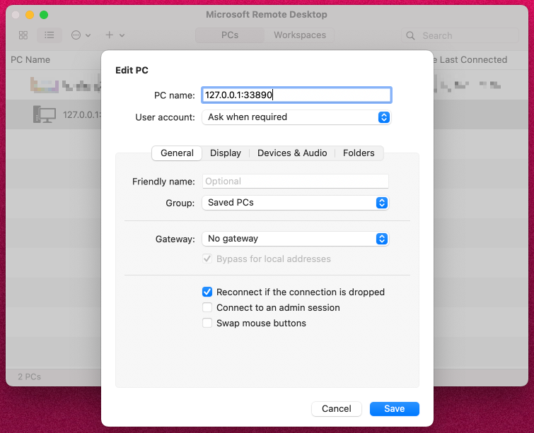
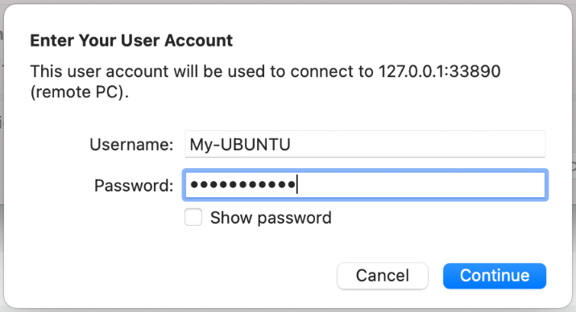
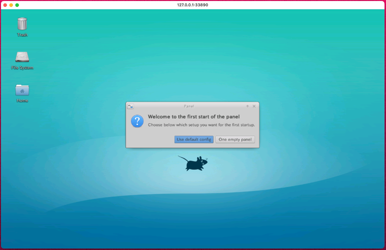
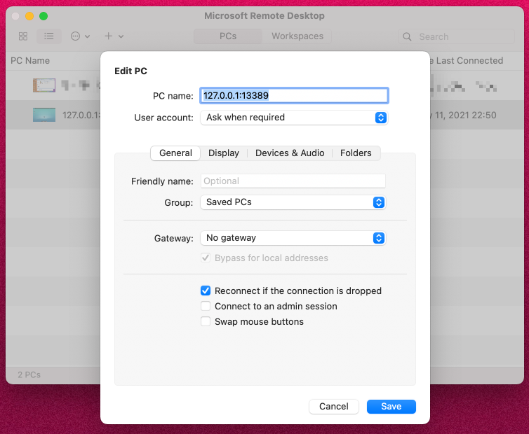
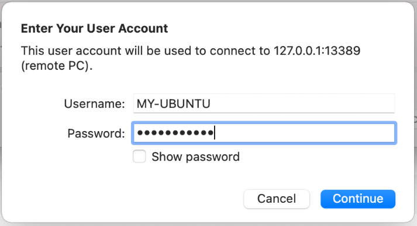
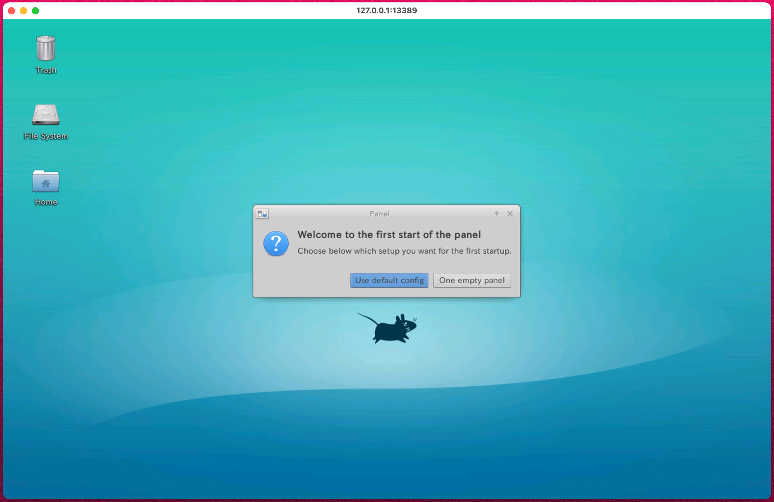
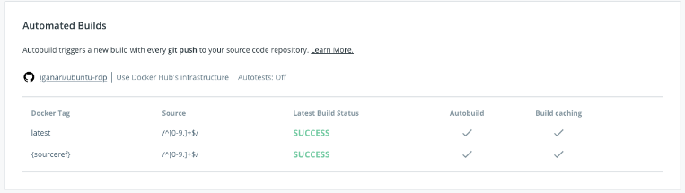

# ubuntu-rdp in iganari

## 概要

Ubuntu に Xfce をインストールし、 RDP 接続を可能したもので、[@Rosyuku](https://github.com/Rosyuku) の [GitHub | Rosyuku/ubuntu-rdp](https://github.com/Rosyuku/ubuntu-rdp) (and [Docker Hub | rosyuku/ubuntu-rdp](https://hub.docker.com/r/rosyuku/ubuntu-rdp)) を Fork し、カスタマイズしたものです
 
多謝 (-人-)

## Docker Compose を使って起動する

+ Repository を Clone

```
git clone https://github.com/iganari/ubuntu-rdp.git
cd ubuntu-rdp
```

+ Docker Compose で起動する

```
docker-compose up --build
```

+ RDP ツール (例えば Microsoft Remote Desktop) を用いて `127.0.0.1:33890` にログインする







## コンテナイメージを pull して起動する

+ [Docker Hub | iganarix/ubuntu-rdp](https://hub.docker.com/r/iganarix/ubuntu-rdp) からコンテナイメージを直接取得して起動する

```
docker run --rm -it -p 13389:3389 -p 10022:22 --shm-size=256m iganarix/ubuntu-rdp:latest
```

+ RDP ツール (例えば Microsoft Remote Desktop) を用いて `127.0.0.1:13389` にログインする







## 自分好みにカスタマイズする

+ 推奨 ---> [自分で Dockerfile から作成する](./README.md#自分で-dockerfile-から作成する)
+ お手軽にやりたい人 ---> [Docker hub のコンテナイメージをカスタマイズする](./README.md#docker-hub-のコンテナイメージをカスタマイズする)

### 自分で Dockerfile から作成する

この Repository を Fork するか、本家の Respotiroy を Fork してカスタマイズする

それをプライベートのレジストリに登録し使用する

### Docker hub のコンテナイメージをカスタマイズする

[Docker Hub | iganarix/ubuntu-rdp](https://hub.docker.com/r/iganarix/ubuntu-rdp) のコンテナイメージを Dockerfile の FROM に使ってカスタマイズする

+ Dockerfile

```
FROM iganarix/ubuntu-rdp:latest

~
~
```

## デプロイについて

+ デフォルトブランチ
  + master
+ タグ
  + `x.x.x` の形
  + タグをつけ GitHub に Push すると Docker Hub にて自動ビルドが走る
  + 最新のタグ `x.x.x` と `latest` が自動ビルドされる



## まとめ

Have fan! :)
